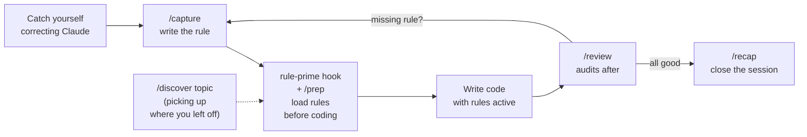
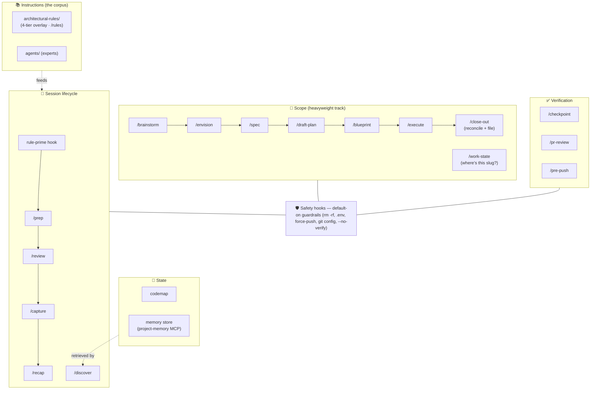
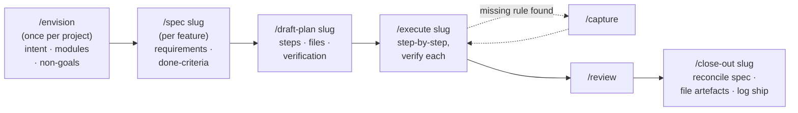

# contexture

The setup I use to work with AI: a discipline loop, an architectural-rule corpus, safety hooks, and a memory store. I mostly work with Claude, so it's built around Claude, though the instruction layer should port to other agents too.

I built it mostly to get better at my own work — something good, efficient, and genuinely useful. I wanted it to match my vibe and workflow, to fit my ways and keep both of us on track while leaving room to move. So it sits between fully robust and loose enough to bend.

Setup isn't a plugin (at least not yet) — you clone the repo and run a bootstrap to wire it into Claude. The defaults lean a certain way because they're how I work, but they're not meant to stay that way: the rule overlay (`/rules`) and per-machine config let you bend them to yours. I'm sharing it in case it's useful to someone working a similar way. [MIT](LICENSE)-licensed.

## Contents

1. [The discipline loop](#the-discipline-loop) — what it actually does, with a real `/review` transcript.
2. [Quick start](#quick-start) — clone, bootstrap, one line.
3. [What you get](#what-you-get) — the harness, at a glance.
4. [How I use it](#how-i-use-it) — the everyday loop vs the heavyweight track.
5. [Other agents (cross-tool)](#other-agents-cross-tool) — Codex, Cursor, Copilot, Gemini, …
6. [A note on Obsidian](#a-note-on-obsidian) · [Customising](#customising) · [Philosophy](#philosophy) · [Origin](#origin)
7. [Full reference](docs/reference.md) — the exhaustive folder-by-folder breakdown.

## The discipline loop

My motivation to start this was simple: *I kept catching myself correcting Claude on the same thing twice.* It would keep importing from the wrong layer, or naming things in a style I'd dropped, and I didn't want to keep repeating myself. So the idea: write the rule down once, and the system loads it the next time relevant code gets written, then checks against it after.



On Claude Code this runs as the commands below; on other tools you get the same rule corpus but drive it yourself (see [Other agents](#other-agents-cross-tool)).

1. **You write a rule** — deliberately (`/capture`), or by correcting it mid-session and saying "remember that". Rules are markdown files with a little frontmatter (scope, when-it-applies), stored in `architectural-rules/` or per-project memory.
2. **Relevant rules load before you start coding — mechanically.** A `rule-prime` hook primes the always+project rule floor (plus the one language tier in a single-language repo) into context at session start, and pulls incremental language/domain tiers per prompt by deterministic match. No reliance on the agent remembering to prime. `/prep` still runs on demand for a deeper pass (higher top-N, task-specific domain rules) on top of that floor.
3. **If the work drifts, it asks.** Moving from auth code to billing code mid-task? It surfaces that instead of silently applying the wrong rules.
4. **`/review` audits after the fact** — dead code, monolithic files, separation-of-concerns violations, missing patterns, principle violations, comment drift, and naming/comment quality (machine-flavored names, comments that restate rather than explain). Findings are proposed one at a time: Apply, Skip, Edit, or Won't-fix.
5. **When review misses something, the corpus learns.** You say so, and `/capture` routes the correction back: sharpen a rule, add one, retag, or adjust a threshold.
6. **`/recap` closes the session.** What happened, what was learned, what's next. Learned items can graduate into rule-tier memories.

**The collaborator principle.** Every write — memory, fix, capture — is proposed and you confirm. No silent mutations, no auto-fixes, no background monitoring. The agent suggests; you decide.

### What it looks like in practice

After editing a file, you run `/review`. Roughly:

```
$ /review src/auth/

Loaded 7 architectural rules (universal/layering, web/state, auth/session-handling, ...).
Auditing 3 files...

Finding F1 · 🟠 High · Layering — src/auth/login.ts:42
  Direct database call from controller layer — violates universal/layering.md
  ("controllers go via /domain, never /db").

  Replace L42:
      const user = await db.users.findOne({ email })
  With:
      const user = await userService.findByEmail(email)

  (a)pply / (s)kip / (e)dit / (w)on't-fix [reason]?  > _
```

Each finding is its own decision. Nothing changes silently. When the run ends, `/review` asks *"did this catch what you wanted?"* — answering *no* routes the gap back into `/capture` so the corpus improves.

## Quick start

The full experience is on Claude Code. Three commands, a one-line edit, restart.

```sh
# 1. Clone
cd <your-projects-dir>
git clone https://github.com/AcKeskin/contexture.git contexture

# 2. Bootstrap (idempotent) — links claude-md, architectural-rules, skills,
#    commands, agents, hooks into ~/.claude/, installs the statusline, and
#    merges settings into ~/.claude/settings.json.
cd contexture
node bootstrap/bootstrap.js

# 3. Add the one @import line to ~/.claude/CLAUDE.md (bootstrap deliberately
#    does not mutate your user-owned CLAUDE.md):
#    @claude-md/memory-capture.md

# 4. Restart Claude Code. Effective next session.
```

```sh
node bootstrap/bootstrap.js --dry-run                 # preview
node bootstrap/bootstrap.js --exclude hooks,agents    # skip some subtrees
node bootstrap/bootstrap.js --verify                  # audit current state
```

**Prerequisites:** Node.js 18+ (bootstrap, codemap scripts, MCP builds), git, and Claude Code itself. Optional: `gh` (for `/pr-review`), the .NET SDK + Godot/Unity (only if you build those MCP servers).

Developed and used on **Windows** (PowerShell + Git Bash). The bootstrap, hooks, and codemap scripts are pure Node, so macOS and Linux *should* work — but I haven't run it there, so expect the occasional platform rough edge.

## What you get

The pieces group into five harness subsystems — *how the agent is governed* — plus the safety layer underneath.



| Capability | What it is |
| --- | --- |
| **The discipline loop** | Rules primed before (mechanically, by the `rule-prime` hook + `/prep`), `/review` after, `/capture` to grow the rule corpus. The thing this repo is really about. |
| **Mechanical rule priming** | A `rule-prime` hook puts the relevant rules in context at session start and per prompt — no reliance on the agent remembering to `/prep`. Budget-guarded, deterministic, never blocks a turn. |
| **Observe-and-record organs** | Three artefacts that read a codebase and write down what's tacit: `/update-codemap` (structure), `/extract-conventions` (house style → a project-tier rule the priming + review then enforce), and `/glossary` (the domain's *vocabulary* — term → meaning → code symbol, cited by review as a vocabulary-drift reference). `/write-tests` authors a quality suite for existing code to a standard, with a confirmable plan and a characterization-with-flags stance. |
| **Rule overlay** | A four-tier rule corpus — shipped / company / user / project — that composes update-safely. `/rules` to override (whole-file or field-patch), disable, or resolve. Your edits survive `git pull`. |
| **Autonomy contract** | `/autonomize` sets one *how-hard-to-push* contract (effort / stopping / when-to-ask) that the workflow organs — `/execute`, `/checkpoint`, `/orchestrate`, the spec/plan kickoff — read at their decision points. Set it once as a project default or steer it live ("keep going" / "leave it here"); calibrates a goal-directed run without per-step babysitting. Defaults to current behaviour, so it adds nothing until you tune it. |
| **Stored context** | A codemap (architecture snapshot) + memory store (rules, decisions, lessons) that `/discover` retrieves on demand. |
| **Safety hooks** | Default-on guardrails — block `rm -rf` on top-level paths, writes to `.env`, force-push to main, global git-config edits, `--no-verify` bypass. |
| **Spec → plan → execute → close-out** | A heavyweight track for non-trivial features: interview-driven spec, versioned plan, step-by-step execute with per-step verification, and `/close-out` to reconcile the spec to what shipped + file the spent artefacts + log the ship. `/work-state <slug>` reports where any feature sits in the chain (and flags a plan pinned to a stale spec). |
| **Debugging discipline** | `/systematic-debugging` front-doors a bug: reproduce, instrument, find the root cause first, before any fix is proposed. |
| **Authoring meta-skills** | `/new-hook`, `/new-agent`, `/new-mcp` — interview-driven scaffolding for extending the toolkit. |
| **Humanize prose** | `/humanize` flags and rewrites AI-texture in user-facing writing (READMEs, PRs, email): advisory density, never a binary verdict, calibrated to your own voice. |

The exhaustive breakdown — every hook, skill, agent, MCP tool surface, and the folder layout — lives in **[docs/reference.md](docs/reference.md)**.

## Bundled MCP servers

One MCP is part of the harness itself: **project-memory**, the first-party memory retrieval that backs `/discover` (registered by bootstrap; `/discover` degrades gracefully if it isn't there).

The repo also carries two **game-engine editor bridges** under [`mcps/`](mcps/), a separate concern from the discipline harness. Standalone, opt-in, skippable with `bootstrap --exclude=mcps`. They live here only because I built them alongside everything else, not because anything depends on them:

- **unity** — a substantial Unity Editor automation server (TypeScript server + a C# Editor extension).
- **godot** — a Godot 4.x editor-bridge (TypeScript server + GDScript plugin).

Full tool surfaces in [docs/reference.md](docs/reference.md).

## How I use it

Two loops at different timescales, plus a separate mode for when something's already broken.

**Loop A — the discipline loop (per-session).** The one diagrammed above. Every time I open Claude on any project: `/prep` primes rules, I write code, `/review` audits, `/capture` grows the corpus, `/recap` closes out. For a one-line fix, naked Claude conversation is fine — the loop is overhead for trivial work.

**Loop B — the project-lifecycle scaffold (per-feature).** The heavyweight track for anything bigger than a one-sentence diff. Each phase writes a versioned markdown artefact the next phase reads:



The chain is opt-in and versioned — specs evolve `v1 → v2`, plans rebuild against them, nothing is destroyed. `/close-out` ends it: once the work ships it reconciles the spec to what actually shipped and files the spent plan away. Lost track of where a feature sits? `/work-state <slug>` reports its position in the chain (and flags a plan pinned to a superseded spec).

**When something's broken (a different mode).** Not a loop, not the build track. You show up with a symptom and `/systematic-debugging` front-doors it: reproduce, instrument, root-cause-first, before any fix. It's an investigator's posture, so the tools differ too: a debugger, logs, `git bisect`/`blame`, the codemap to orient. A structural cause can graduate into Loop B (spec a real refactor); a one-liner you just fix.

| Situation | Track |
| --- | --- |
| One-line fix, obvious diff | Naked Claude — no ceremony |
| Typical edits within a known module | Loop A (`/prep` → code → `/review`) |
| New feature spanning files / decisions | Loop B (`/spec` → `/draft-plan` → `/execute` → `/close-out`) |
| Greenfield, no clear shape yet | Loop B with `/envision` upstream |
| Something's broken / a test is failing | `/systematic-debugging` (reproduce → root-cause first) |
| Picking up after a break | `/discover <topic>`, or `/work-state <slug>` for where a feature stands |
| A feature has shipped | `/close-out <slug>` — reconcile the spec, file the plan, log the ship |
| End of a session that produced anything | `/recap` |

## Other agents (cross-tool)

Claude Code is the full experience. Other agents get the **instruction corpus** through a vendor-neutral projection — they don't get the hooks, auto-fire, or hard propose-confirm-commit (those are Claude Code harness features).

- **`AGENTS.md`** (repo root) is the cross-tool surface. It's the [Linux-Foundation vendor-neutral standard](https://agents.md/) that **Codex, Cursor, Aider, Gemini CLI, GitHub Copilot, and Windsurf read natively** — plain Markdown, auto-loaded from the project root. It's a **generated projection** of the discipline corpus (`node skills/project-instructions/project-instructions.mjs`), so it can't drift from the rules — don't hand-edit it.
- **GitHub Copilot** additionally gets `.github/copilot-instructions.md` (lean always-on core) + per-language `.github/instructions/*.instructions.md` (auto-load via `applyTo` globs). The skills are exposed as Agent Skills from a generated `.claude/skills/` mirror after you run `bootstrap`. *(Lightly tested on Copilot; the rest is built to the tools' documented file conventions.)*
- **Codex / Cursor / a local model** — read `AGENTS.md`; no install.

What ports cross-tool: the **instructions** and (for tools that scan them) the **skills as files**. What doesn't: **hooks** (no tool-call interception elsewhere), **auto-fire** (no session-lifecycle events), and **hard propose-confirm-commit** (the editor's accept UI is the soft substitute). The discipline is portable; the enforcement primitives under it are Claude Code-only.

> **Distribution is clone-and-bootstrap, not a plugin.** This is a full harness — the rule corpus and CLAUDE.md layer don't fit the skills-collection plugin model, so a marketplace package would ship a hollow subset. Clone the repo and run bootstrap.

## A note on Obsidian

Several pieces — codemap diagrams (`/codemap-visualize`), `/pr-review` artefacts, and vault exports — write to an **Obsidian vault**, because I keep my notes in Obsidian and wanted the graph view, backlinks, and reflection in one place. That's a personal choice baked in, pointed by a `vaultRoot` config value; if you don't use Obsidian, those features are simply inert — nothing else depends on them.

## Customising

The shipped corpus reflects one developer's standards. To make it yours:

1. **Use the rule overlay (`/rules`).** Your own and your team's rules get an update-safe home that *composes* with the shipped corpus — whole-file override, field-patch, or disable, across four tiers (project > user-local > company > shipped). Higher tiers win; your edits survive `git pull`. This is the intended way to diverge — you don't fork the shipped rules, you layer over them.
2. **Edit `architectural-rules/<scope>/<topic>.md`** to add languages/domains or drop scopes you don't work in.
3. **Edit `claude-md/`** — fragments imported into `~/.claude/CLAUDE.md`.
4. **Add agents / hooks** with `/new-agent` and `/new-hook` (interview-driven), then re-run bootstrap.

## Philosophy

- **Efficient helper for a competent engineer.** An amplifier, not scaffolding or a replacement. Every organ earns its place by leverage (tokens / round-trips / usefulness) over ceremony.
- **Collaborator, not auto-learner.** Every write is proposed and confirmed. No silent mutations.
- **Honest helper.** Objective and direct — weighs trade-offs, surfaces weak reasoning and hidden costs even unasked, never flatters or reflexively agrees.
- **Markdown first.** Every artefact is reviewable as prose before it becomes behaviour.
- **Proposals before code.** Mistakes cost paragraphs, not refactors.
- **You own the sync boundary.** The repo ships defaults; you decide what travels.

## Origin

This started as a personal research project — me trying out different AI-agent plugins, conventions, and ways of working, and keeping whatever actually held up. The pieces that proved themselves got folded into what you see here. The messy history and the dead ends stay private; what's public is just the part that worked.

---

*Full folder-by-folder reference: **[docs/reference.md](docs/reference.md)**.*
