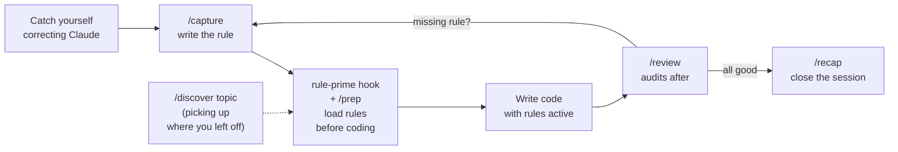
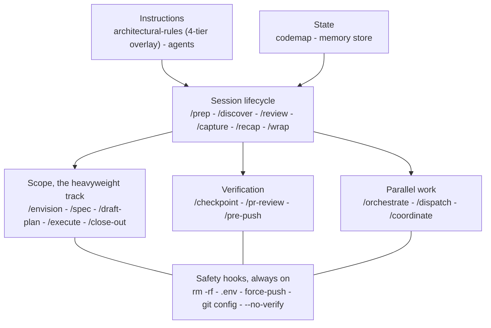
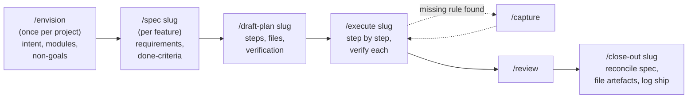

# contexture

The setup I use to work with AI. A rule corpus that loads itself before I write code, a review pass that checks against it after, safety hooks, and a memory store.

I built it to get better at my own work, after catching myself correcting Claude on the same thing twice. It's built around Claude Code because that's what I use, though the instruction layer ports to other agents. The defaults are how I work, not how you have to: the rule overlay and per-machine config are there to bend them. Sharing it in case it's useful to someone working a similar way. [MIT](LICENSE).

## Quick start

Clone, bootstrap, restart. It's not a plugin, so there's no marketplace install.

```sh
cd <your-projects-dir>
git clone https://github.com/AcKeskin/contexture.git contexture
cd contexture
node bootstrap/bootstrap.js
```

Bootstrap is idempotent. It links `claude-md`, `architectural-rules`, `skills`, `commands`, `agents` and `hooks` into `~/.claude/`, and merges settings into `~/.claude/settings.json`. Restart Claude Code and it's live. Nothing to add to your CLAUDE.md.

```sh
node bootstrap/bootstrap.js --dry-run                 # preview
node bootstrap/bootstrap.js --exclude hooks,agents    # skip subtrees
node bootstrap/bootstrap.js --verify                  # audit current state
```

**You need** Node 18+, git, and Claude Code. Optional: `gh` for `/pr-review`, and the .NET SDK plus Godot/Unity only if you build those MCP servers.

**Platform caveat.** I develop and use this on Windows (PowerShell and Git Bash). The bootstrap, hooks and codemap scripts are plain Node, so macOS and Linux should work, but I haven't run it there. Expect rough edges.

## The loop

The whole idea in one line: write a rule down once, and the system loads it next time it's relevant, then checks against it after.


```mermaid
flowchart LR
  A[Catch yourself<br/>correcting Claude] --> B["/capture<br/>write the rule"]
  B --> C["rule-prime hook<br/>+ /prep<br/>load rules<br/>before coding"]
  D0["/discover topic<br/>(picking up<br/>where you left off)"] -.-> C
  C --> D[Write code<br/>with rules active]
  D --> E["/review<br/>audits after"]
  E -->|missing rule?| B
  E -->|all good| F["/recap<br/>close the session"]
```

1. **A rule gets written.** Deliberately with `/capture`, or by correcting Claude mid-session and saying "remember that". Rules are markdown with a bit of frontmatter (scope, when it applies), in `architectural-rules/` or per-project memory.
2. **Rules load before coding, mechanically.** A `rule-prime` hook puts the always and project tiers in context at session start, plus the language tier in a single-language repo, and pulls incremental tiers per prompt by deterministic match. Nothing depends on the agent remembering. `/prep` runs a deeper pass on top when you want it.
3. **Drift gets surfaced.** Moving from auth code to billing mid-task, it says so instead of quietly applying the wrong rules.
4. **`/review` audits after.** Dead code, monolithic files, separation-of-concerns violations, missing patterns, principle violations, comment drift, and naming quality (machine-flavoured names, comments that restate instead of explain).
5. **Misses feed back.** Say review missed something and `/capture` routes it: sharpen a rule, add one, retag, adjust a threshold.
6. **`/recap` closes the session.** What happened, what was learned, what's next. Learned items can graduate into rules.

**Everything is proposed, never applied silently.** Memory writes, fixes, captures: all of them stop and ask. The agent suggests, you decide.

### What a run looks like

```
$ /review src/auth/

Loaded 7 architectural rules (universal/layering, web/state, auth/session-handling, ...).
Auditing 3 files...

Finding F1 - High - Layering - src/auth/login.ts:42
  Direct database call from controller layer, violates universal/layering.md
  ("controllers go via /domain, never /db").

  Replace L42:
      const user = await db.users.findOne({ email })
  With:
      const user = await userService.findByEmail(email)

  (a)pply / (s)kip / (e)dit / (w)on't-fix [reason]?  > _
```

Each finding is its own decision. At the end, review asks whether it caught what you wanted. Saying no routes the gap into `/capture`.

## What's in it

Five subsystems, plus safety hooks underneath everything.


```mermaid
flowchart TB
  INST["Instructions<br/>architectural-rules (4-tier overlay) - agents"]
  STATE["State<br/>codemap - memory store"]
  LOOP["Session lifecycle<br/>/prep - /discover - /review - /capture - /recap - /wrap"]
  SCOPE["Scope, the heavyweight track<br/>/envision - /spec - /draft-plan - /execute - /close-out"]
  VER["Verification<br/>/checkpoint - /pr-review - /pre-push"]
  PAR["Parallel work<br/>/orchestrate - /dispatch - /coordinate"]
  HOOKS["Safety hooks, always on<br/>rm -rf - .env - force-push - git config - --no-verify"]

  INST --> LOOP
  STATE --> LOOP
  LOOP --> SCOPE
  LOOP --> VER
  LOOP --> PAR
  SCOPE --- HOOKS
  VER --- HOOKS
  PAR --- HOOKS
```

| Capability | What it is |
| --- | --- |
| **The loop** | Rules primed before, `/review` after, `/capture` to grow the corpus. What this repo is really about. |
| **Mechanical priming** | The `rule-prime` hook puts relevant rules in context at session start and per prompt. Budget-guarded, deterministic, never blocks a turn. |
| **Rule overlay** | Four tiers that compose update-safely: shipped, company, user, project. `/rules` to override a whole file, patch a field, or disable. Your edits survive `git pull`. |
| **Observe and record** | Three organs that read a codebase and write down what's tacit: `/update-codemap` (structure), `/extract-conventions` (house style, as a project-tier rule), `/glossary` (domain vocabulary, cited by review). `/write-tests` authors a suite for existing code. |
| **Stored context** | A codemap and a memory store of rules, decisions and lessons, retrieved on demand by `/discover`. |
| **Safety hooks** | Default-on. Block `rm -rf` on top-level paths, writes to `.env`, force-push to main, global git-config edits, and `--no-verify` bypass. |
| **Spec to ship** | The heavyweight track: interview-driven spec, versioned plan, step-by-step execute with per-step verification, `/close-out` to reconcile the spec to what shipped. `/work-state <slug>` says where a feature sits, and flags a plan pinned to a stale spec. |
| **Parallel work** | `/orchestrate` splits one goal into units, places each (shared tree, worktree, or serialized), fans them out, then verifies and converges. `/coordinate` keeps several live sessions aligned through a shared board so two of them don't edit the same files. |
| **Autonomy contract** | `/autonomize` sets one contract for how hard to push, when to stop, when to ask. `/execute`, `/checkpoint` and `/orchestrate` read it at their decision points. Defaults to current behaviour, so it costs nothing until you tune it. |
| **Debugging** | `/systematic-debugging` front-doors a bug: reproduce, instrument, find the root cause, before any fix. |
| **Authoring** | `/new-hook`, `/new-agent`, `/new-mcp` scaffold extensions by interview. |
| **Prose** | `/humanize` flags and rewrites AI texture in user-facing writing. Advisory density, never a binary verdict. |

Every hook, skill, agent and MCP tool is listed in [docs/reference.md](docs/reference.md).

## How I use it

Two loops at different speeds, and a separate mode for when something's already broken.

**Per session.** The loop above. `/prep` primes, I write code, `/review` audits, `/capture` grows the corpus, `/wrap` closes it out (recap, then close-out if something shipped, then changelog and backlog sweep) so I don't run each by hand. For a one-line fix I skip all of it and just talk to Claude.

**Per feature.** The heavyweight track, for anything bigger than a one-sentence diff. Each phase writes a versioned markdown file the next phase reads.


```mermaid
flowchart LR
  V["/envision<br/>(once per project)<br/>intent, modules,<br/>non-goals"] --> S["/spec slug<br/>(per feature)<br/>requirements,<br/>done-criteria"]
  S --> P["/draft-plan slug<br/>steps, files,<br/>verification"]
  P --> E["/execute slug<br/>step by step,<br/>verify each"]
  E -.->|missing rule found| C["/capture"]
  C -.-> E
  E --> R["/review"] --> X["/close-out slug<br/>reconcile spec,<br/>file artefacts, log ship"]
```

Specs evolve v1 to v2, plans rebuild against them, nothing is destroyed. `/close-out` ends the chain: it reconciles the spec to what actually shipped and files the spent plan away.

**When something's broken.** Not a loop. You turn up with a symptom and `/systematic-debugging` takes it: reproduce, instrument, root cause first, before any fix is proposed. Different posture, different tools (a debugger, logs, `git bisect`, the codemap to orient). A structural cause can graduate into the feature track; a one-liner you just fix.

| Situation | What I run |
| --- | --- |
| One-line fix, obvious diff | Nothing. Plain Claude. |
| Normal edits in a module I know | `/prep`, code, `/review` |
| A feature spanning files and decisions | `/spec`, `/draft-plan`, `/execute`, `/close-out` |
| Greenfield with no shape yet | Same, with `/envision` first |
| Something's broken | `/systematic-debugging` |
| Several independent tasks at once | `/orchestrate` |
| Picking up after a break | `/discover <topic>`, or `/work-state <slug>` |
| End of a session that produced something | `/wrap` |

## Other agents

Claude Code is the full experience. Other agents get the instruction corpus through a generated projection. They don't get hooks, auto-fire, or the propose-confirm gate, because those are Claude Code features.

- **`AGENTS.md`** at the repo root is the cross-tool surface, the [vendor-neutral standard](https://agents.md/) that Codex, Cursor, Aider, Gemini CLI, Copilot and Windsurf read natively. It's generated from the corpus (`node skills/project-instructions/project-instructions.mjs`), so don't hand-edit it. Re-run the projector after changing any rule.
- **Copilot** also gets `.github/copilot-instructions.md` and per-language `.github/instructions/*.instructions.md`, which auto-load by glob. Skills show up as Agent Skills from the `.claude/skills/` mirror bootstrap creates. Lightly tested.
- **Codex, Cursor, a local model:** they read `AGENTS.md`. No install.

What ports: the instructions, and the skills as files for tools that scan them. What doesn't: hooks (nothing else intercepts tool calls), auto-fire (no session-lifecycle events), and the hard propose-confirm gate (an editor's accept UI is the soft version). The discipline travels; the enforcement under it doesn't.

## Making it yours

The shipped corpus is one developer's standards. To diverge:

1. **Use `/rules`.** The overlay is the intended way. Override a whole file, patch a single field, or disable a rule, at project, user or company tier. Higher tiers win and your edits survive `git pull`. You don't fork the shipped rules, you layer over them.
2. **Edit `architectural-rules/<scope>/`** to add a language or domain, or drop scopes you don't work in.
3. **Edit `claude-md/`**, the fragments imported into your `~/.claude/CLAUDE.md`.
4. **Add agents and hooks** with `/new-agent` and `/new-hook`, then re-run bootstrap.

## MCP servers

**project-memory** is part of the harness. It backs `/discover`, and bootstrap registers it. `/discover` degrades gracefully if it isn't there.

The repo also carries two game-engine editor bridges under [`mcps/`](mcps/). They're a separate concern, standalone and opt-in, skippable with `bootstrap --exclude=mcps`. They live here because I built them alongside everything else, not because anything depends on them.

- **unity**, a Unity Editor automation server (TypeScript server plus a C# Editor extension).
- **godot**, a Godot 4.x editor bridge (TypeScript server plus a GDScript plugin).

## Notes

**On Obsidian.** Codemap diagrams, `/pr-review` artefacts and vault exports write to an Obsidian vault, because that's where I keep notes and I wanted the graph view and backlinks in one place. It's a personal choice, pointed at by a `vaultRoot` config value. Without it those features are inert and nothing else cares.

**What I was aiming for.**

- An amplifier for someone who can already do the work, not scaffolding and not a replacement. Every organ earns its place by leverage over ceremony.
- A collaborator, not an auto-learner. Every write is proposed and confirmed.
- Honest. It weighs trade-offs and surfaces weak reasoning even when I didn't ask, instead of agreeing with me.
- Markdown first, so every artefact is reviewable as prose before it becomes behaviour.
- Proposals before code, so mistakes cost paragraphs instead of refactors.
- You own the sync boundary. The repo ships defaults and you decide what travels.

**Where it came from.** A personal research project: trying out agent plugins, conventions and ways of working, and keeping whatever held up. The parts that proved themselves ended up here. The messy history and the dead ends stay private.

---

Full folder-by-folder reference: **[docs/reference.md](docs/reference.md)**.
