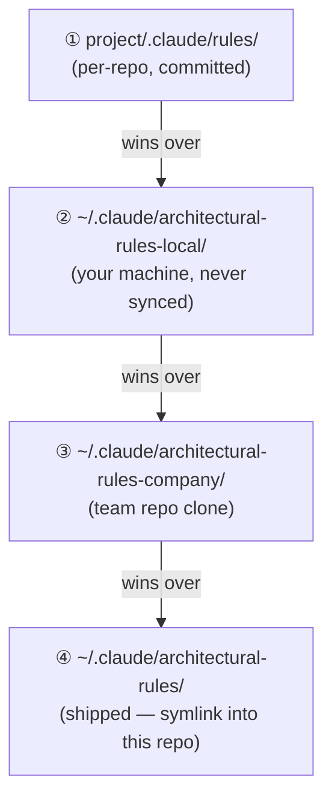

# contexture — full reference

The exhaustive folder-by-folder reference, split out of the README to keep the front door short.
For the overview, the discipline loop, and install, see the [README](../README.md).

## Layout

> Looking for a deeper architecture view (module map, per-module file graphs, cross-module relations)? Run `/codemap-visualize` (or `node skills/codemap-visualize/codemap-visualize.mjs`) — it generates `.claude/codemap.diagrams.md` locally. That file is gitignored (regenerated per-machine, not shipped), so it won't exist until you run the skill. The tree below is just the folder skeleton.

```
contexture/
├── README.md
├── bootstrap/                   # install scripts (Node — Windows-tested, untested elsewhere)
│   ├── bootstrap.js
│   └── lib/                     # platform / link / settings / ccline
├── settings/                    # settings.json template + per-machine override
├── skills/                      # one folder per skill, each with SKILL.md (committed source; bootstrap mirrors into gitignored .claude/skills/ for Copilot/Codex/Cursor discovery)
│   ├── prep/   review/   pr-review/   capture/   recap/   discover/
│   ├── pr-author/   pr-respond/   pre-push/        # GitHub reviewee triad
│   ├── deliver/                 # library-only (no slash command)
│   ├── update-codemap/   codemap-visualize/
│   ├── new-hook/   new-agent/   new-mcp/   new-agents-md/
│   ├── project-instructions/    # cross-tool projection (AGENTS.md + Copilot)
│   ├── memory-audit/
│   ├── brainstorm/   envision/   spec/   draft-plan/   blueprint/   execute/
│   ├── checkpoint/   human-view/   coordinate/   # fit-check · approval view · multi-session board
│   ├── retrospect/   retrospect-core/   system-review/  # meta-review (retrospect + system-review deprecated → /checkpoint)
│   ├── orchestrate/             # goal-directed concurrent-work convergence
│   ├── systematic-debugging/    # yoinked from superpowers plugin
│   ├── test-driven-development/ # yoinked
│   ├── dispatch/
│   ├── improve-prompt/
│   └── using-git-worktrees/
├── commands/                    # slash-command shims, one file each
├── agents/                      # subagents (cpp-pro, c-sharp-pro, rust-pro, react-pro, security-reviewer, metal-video-source-pro, vision-os-pro, unity-pro, unity-ui-pro, mcp-ts-pro, mcp-py-pro)
├── hooks/                       # Node hook scripts (default-on protection — see docs/security-hooks.md)
│   ├── rm-rf-blocker.js
│   ├── env-file-write-blocker.js
│   ├── outside-project-write-blocker.js
│   ├── force-push-main-blocker.js
│   ├── git-config-write-blocker.js
│   ├── hook-skip-blocker.js
│   ├── bootstrap-drift-injector.js
│   ├── agent-output-contract-validator.js
│   ├── codemap-dirty-marker.js
│   ├── clear-context-decision-guard.js
│   └── lib/                     # shared hook-io + path utilities
├── mcps/                        # MCP server projects (standalone, not bootstrapped)
│   ├── lib/                     # shared TypeScript utilities (fetch, rate-limit, errors)
│   ├── lib-py/                  # shared Python utilities (fetch, rate-limit, errors)
│   ├── project-memory/          # first-party memory-retrieval MCP (registered by bootstrap)
│   └── unity/                   # Unity Editor MCP server (see “Unity MCP” section)
├── claude-md/                   # fragments imported into ~/.claude/CLAUDE.md
│   ├── _imports.md
│   └── memory-capture.md        # frontmatter + folder-layout rules
├── architectural-rules/         # tagged rule memories, synced across machines (shipped tier)
│   ├── universal/   config-authoring/                     # govern user code / govern harness-authoring
│   ├── bash/   cpp/   csharp/   python/   rust/   sql/   typescript/   unity/   web/
│   └── README.md
└── docs/                        # Claude-facing reference, one per organ
    ├── _implementing/           # one-pagers (gitignored, short-lived)
    └── *.md                     # permanent references
```

Directories are created lazily as proposals require them — no speculative scaffolding.

## What's in each folder

### hooks/ — Safety guardrails (PreToolUse event handlers)

| Hook | Event | What it does |
|------|-------|--------------|
| `rm-rf-blocker` | PreToolUse / Bash | Blocks destructive `rm -rf` on top-level paths (root, home, parent directories) |
| `env-file-write-blocker` | PreToolUse / Write* | Blocks writes to `.env`, credentials, API keys, and certificates |
| `force-push-main-blocker` | PreToolUse / Bash | Blocks force pushes to main/master; feature branches are unrestricted |
| `git-config-write-blocker` | PreToolUse / Bash | Blocks global/system git config writes; local project-level config allowed |
| `hook-skip-blocker` | PreToolUse / Bash | Blocks `--no-verify` / `--no-gpg-sign` unless `/allow-skip-hooks` was used first |
| `outside-project-write-blocker` | PreToolUse / Write* | Blocks writes outside the project directory (allow-lists `~/.claude` and per-machine entries in `hook-config.json`) |
| `bootstrap-drift-injector` | SessionStart | Warns when the local bootstrap state is stale relative to the repo |
| `agent-output-contract-validator` | PostToolUse / Agent | Advisory — validates subagent output against the contract declared by the agent file. Posts a `hookSpecificOutput.additionalContext` advisory; never blocks |
| `codemap-dirty-marker` | PostToolUse / Write* | Opt-in per project via `.claude/codemap.config.md` `## Auto-update` `enabled: true`. Touches `.claude/codemap.dirty` so the next `/update-codemap` knows the codemap is stale |
| `clear-context-decision-guard` | SessionStart [clear/compact] | Advisory — scans the prior transcript for unrecapped decision signals after a clear/compact and surfaces a recap nudge via `{ context }` at the next session start; never blocks |
| `lib/hook-io.js` | — | *Shared utility — payload reading, fail-open exit codes, `advise()` helper for PostToolUse advisories* |

Hooks ship in three default-on bundles (`security`, `gitDiscipline`, `bootstrapDrift`) plus `agentOutputContracts` and `codemapDirty`. Bundles can be excluded per machine in `~/.claude/hook-config.json` under `enabled.hookBundles`. All hooks fail-open (exit 0 = allow, exit 2 = block, JSON stdout = advise). See [security-hooks](security-hooks.md).

### skills/ — Autonomous behavioural organs

Each skill has a `SKILL.md` that defines when it fires, what it does, and how it interacts with the user.

| Skill | Purpose |
|-------|---------|
| `prep` | Primes session with architectural rules before coding; auto-fires on first substantive task |
| `review` | Audits code against loaded rules for 6 drift categories (dead code, monoliths, SoC, patterns, principles, comments). Supports `--vault` to persist to Obsidian |
| `pr-review` | Reviews a GitHub PR via `gh` CLI across correctness/design/hygiene/security. Writes a canonical artefact to the Obsidian vault with iteration tracking (flat → folder on iteration 2) and stub redirects so wikilinks never break |
| `capture` | Stores memories via propose-confirm-commit with relation tracking and secret redaction |
| `recap` | Writes episodic session records; promotes learned items to rule-tier via capture |
| `discover` | Retrieves relevant memories and codemap entries for the current task by scope/keyword |
| `deliver` | Renders memory fragments into working context (library-only — not user-invoked) |
| `pr-author` | Drafts a PR title + body to a clean contract (Summary / Test plan / Closes) and hands over a ready-to-run `gh pr create` — never opens the PR itself |
| `pr-respond` | Structures responses to PR review comments — groups by theme, applies local code edits, drafts GitHub replies for you to post (never posts itself) |
| `pre-push` | Pre-push pre-flight checklist — commits-to-ship summary, branch-name / commit-hygiene / AI-attribution / debug-artifact / hook-bypass checks; stops on any flag |
| `spec` | Interview-driven versioned spec under `.claude/specs/<slug>/`; mandatory `done_criteria:` frontmatter; INDEX tracks the active version |
| `draft-plan` | Produces a versioned plan from the active spec, with a propose-confirm review gate before the plan lands on disk |
| `blueprint` | Authors a concrete pre-build blueprint — intent (what we wanted) + the mature shape (classes, interfaces, dependencies, module relationships, build order) with Mermaid UML, from vision+spec+plan or `--from-code`; optional, after `/draft-plan` |
| `human-view` | Projects an LLM-optimized planning artefact (plan / blueprint / spec / vision) into a human-readable approval view — goal + concrete decisions + an alignment check |
| `execute` | Runs a plan step-by-step with per-step verification gates |
| `orchestrate` | Goal-directed orchestration & convergence for concurrent work — decompose-or-refuse, place each unit (shared tree / worktree / serialize), fan out via `dispatch`, verify-then-converge (merge or synthesis) |
| `coordinate` | Keeps multiple live sessions aligned via a shared gitignored session board — register / check / hand-off / collision-detect; a session can claim coordinator. Peer-session alignment, distinct from subagents |
| `checkpoint` | Scope-dialed fit-and-intent check (diff / module / corpus) — "does this serve the point + cohere + what did I learn?"; diff scope composes `/code-review` + a fit-pass. Supersedes the now-deprecated `retrospect` + `system-review` |
| `update-codemap` | Regenerates `.claude/codemap.md` with file tree, purposes, exports + signatures, entry points, layers, inter-module dependency adjacency, and a class graph (TS/C#/C++ — fields, extends/implements, namespace, attributes). Clears the dirty sentinel after a successful write |
| `codemap-visualize` | Renders a UML-heavy document from `.claude/codemap.md` — ASCII Structure tree, topologically auto-layered Module map, per-module sections with class diagrams + subfolder-clustered file graphs, and a cross-module class relations diagram. Writes to `.claude/codemap.diagrams.md` and the Obsidian vault under `Projects/<ProjectFolder>/Codemap/` |
| `brainstorm` | Shapes a half-formed idea or crystallizes a blurry one (name, one-line description, in/out edges, end-goal) — upstream of `/envision`; writes a light `.claude/ideas/<slug>.md` note |
| `envision` | Interview-driven top-level project vision — intent, UX walkthrough, 4–8 named modules (role/owns/depends-on/does-not-do), boundaries, relations, cross-cutting concerns, non-goals (≥ 3), mandatory module-map diagram. Versioned under `.claude/visions/<slug>/v<N>.md`. Upstream of `/spec`. Breadth-over-depth — refuses to drift into implementation detail |
| `systematic-debugging` | Enforces root-cause investigation before fixes (4-phase process) |
| `test-driven-development` | Enforces red-green-refactor discipline before implementation |
| `new-hook` | End-to-end hook scaffolding with recipe selection and settings merge |
| `new-agent` | Interview-driven subagent scaffolding (job-to-be-done, anti-patterns, debug workflow) |
| `new-mcp` | Interview-driven MCP server scaffolding (TypeScript/Python, simple/API wrapper) |
| `new-agents-md` | Distill-then-interview generator that projects the discipline corpus into a vendor-neutral root `AGENTS.md` for non-Claude agents (interactive companion to `project-instructions`) |
| `project-instructions` | Deterministic cross-tool projector — regenerates root `AGENTS.md`, lean `.github/copilot-instructions.md`, and per-scope `.github/instructions/*.instructions.md` from the corpus (`node skills/project-instructions/project-instructions.mjs`) |
| `dispatch` | Delegates independent problems to parallel subagents with depth caps |
| `improve-prompt` | Improves any prompt — text/LLM or generative image/video/audio — model-agnostically; interviews to fill real gaps, then returns a rewritten prompt plus rationale (what changed, assumptions, optional per-model notes) |
| `using-git-worktrees` | Creates isolated worktrees with gitignore safety and baseline test verification |
| `memory-audit` | Checks memory tree for 9 integrity dimensions (orphans, dupes, schema gaps, stale refs) |
| `rules` | Manages the architectural-rule overlay across the shipped / company / user / project tiers — list, disable/enable (global/project/session), whole-file or field-patch override, resolve (`where`), sync company repo. Every mutation previews before→after on the effective corpus |

### commands/ — Slash-command shims

Each file is a thin entrypoint that delegates to the corresponding skill. One file per command.

| Command | Invokes |
|---------|---------|
| `/prep` | `skills/prep` |
| `/review` | `skills/review` |
| `/pr-review` | `skills/pr-review` |
| `/pr-author` | `skills/pr-author` |
| `/pr-respond` | `skills/pr-respond` |
| `/pre-push` | `skills/pre-push` |
| `/capture` | `skills/capture` |
| `/recap` | `skills/recap` |
| `/discover` | `skills/discover` |
| `/execute` | `skills/execute` |
| `/draft-plan` | Produces a versioned plan from an active spec |
| `/spec` | Interviews the user, writes a versioned spec under `.claude/specs/` |
| `/blueprint` | `skills/blueprint` |
| `/brainstorm` | `skills/brainstorm` |
| `/checkpoint` | `skills/checkpoint` |
| `/human-view` | `skills/human-view` |
| `/coordinate` | `skills/coordinate` |
| `/envision` | Interviews the user, writes a versioned top-level project vision under `.claude/visions/` |
| `/improve-prompt` | `skills/improve-prompt` |
| `/update-codemap` | `skills/update-codemap` |
| `/codemap-visualize` | `skills/codemap-visualize` |
| `/new-hook` | `skills/new-hook` |
| `/new-agent` | `skills/new-agent` |
| `/new-mcp` | `skills/new-mcp` |
| `/memory-audit` | `skills/memory-audit` |
| `/rules` | `skills/rules` |
| `/allow-skip-hooks` | Arms hook-skip-blocker to permit the next N git bypass commands |

A few skills have no command shim and are invoked by name or auto-fire only: `orchestrate`, `new-agents-md`, `deliver` (library-only), `dispatch`, `systematic-debugging`, `test-driven-development`, `using-git-worktrees`, `project-instructions` (run as a Node CLI).

### agents/ — Specialized subagent definitions

Language and domain experts with tailored system prompts, tool allowlists, and model selections.

| Agent | Domain |
|-------|--------|
| `cpp-pro` | Modern C++ (C++11–23) — RAII, smart pointers, templates, performance |
| `c-sharp-pro` | Modern C# / .NET — async, LINQ, EF Core, ASP.NET Core |
| `rust-pro` | Idiomatic Rust — ownership, lifetimes, traits, async with Tokio |
| `react-pro` | React 19+ — hooks, Server Components, concurrent rendering |
| `metal-video-source-pro` | Metal textures from VideoToolbox via zero-copy IOSurface bridging |
| `vision-os-pro` | visionOS — RealityKit, ARKit, Swift↔Obj-C++ bridging |
| `unity-pro` | Unity 2022.3+ — gameplay, scenes/prefabs, ScriptableObject, Addressables, scripting perf, build pipeline |
| `unity-ui-pro` | Unity UI — UI Toolkit (UXML/USS/UIDocument) and UGUI, data binding, gamepad/keyboard input, runtime UI perf |
| `security-reviewer` | OWASP Top 10 / LLM Top 10 / Zero Trust vulnerability review |
| `mcp-ts-pro` | TypeScript MCP servers — @modelcontextprotocol/sdk, Zod schemas, stdio/HTTP transport |
| `mcp-py-pro` | Python MCP servers — FastMCP, httpx, async tools, venv setup |

### mcps/ — MCP server projects

MCP (Model Context Protocol) server projects scaffolded by `/new-mcp`. Most are standalone — registered directly in `~/.claude.json` and run independently. The exception is `project-memory/`, the first-party memory MCP, which the bootstrap registers for you.

| Directory | Purpose |
|-----------|---------|
| `lib/` | Shared TypeScript utilities for API-wrapping servers (fetch, rate limiting, error formatting) |
| `lib-py/` | Shared Python utilities for API-wrapping servers (httpx-based fetch, rate limiting, errors) |
| `project-memory/` | First-party memory-retrieval MCP — three discover-shaped tools over the per-project memory store; retrieval-only; **registered by bootstrap** (the one MCP that is not standalone) |
| `unity/` | Custom Unity Editor MCP — TypeScript server + C# Editor extension (see below) |
| `godot/` | Custom Godot 4.x editor-bridge MCP — TypeScript server + GDScript editor plugin (see below) |
| `<name>/` | Individual MCP server projects (created by `/new-mcp`) |

#### Unity MCP

`mcps/unity/` is a custom Unity Editor MCP server developed in-tree alongside the other contexture tooling. Two processes — a TypeScript MCP server (stdio) and a C# Unity Editor extension (local HTTP bridge) — communicating over `localhost`. Tool surface is project-aware: capability negotiation at connect-time enables/disables tools based on installed packages (URP/HDRP, XRI, MRTK 3, test framework, etc.).

Domains exposed today (incremental slices A–N + post-N work):

| Domain | Representative tools |
|---|---|
| Scene / GameObject | `scene_info`, `scene_load`, `scene_save`, `scene_create` (seeds Main Camera + Directional Light by default; opt-in EventSystem; capability-aware XR rig from a template prefab), `go_create`, `go_find`, `go_set_transform`, `go_set_parent` |
| Component | `component_add`, `component_remove`, `component_set_property` / `component_set_properties` (asset refs by `{$guid}` / `{$path}`), `component_describe` |
| Asset pipeline | `asset_find`, `asset_create`, `asset_move`, `asset_import`, `asset_get_dependencies`, `manage_material` |
| Project settings | `manage_project_settings` (Tags / Layers / Quality), `manage_camera`, `manage_physics` |
| Input System | `manage_input` — read (`list_assets` / `inspect_asset` / `find_action`) **and** write `.inputactions` (`create_asset` / `add_map` / `add_action` / `add_binding` / `remove_*`) via the Input System API so Unity owns the GUIDs and `.meta` |
| Packages | `manage_packages` (UPM ops) |
| Scripts | `script_manage`, `script_find`, `script_edit` |
| Tests / Play Mode | `run_tests` (TestRunnerApi-backed), `playmode_set` (bounded Play Mode control) |
| Console | `console_read`, `console_filter`, `console_clear` |
| UI authoring | `ui_create_button`, `ui_create_text`, `ui_create_panel`, `ui_create_image`, `execute_menu_item` |
| Discovery / visibility | `component_describe`, `component_preview`, `component_tree` |
| Documentation | `unity_docs` (fetch official Unity docs) |
| Reflection | `unity_reflect` (read-only C# API inspection) |
| Validation | `validate_component` (generalized validator with MRTK rules under `#if UNITY_MCP_HAS_MRTK`) |
| Orchestration | `procedure_run` (server-side multi-step orchestrator — collapses N atomic frame-boundary waits into 1) |
| MRTK 3 | `mrtk3_*` family (inspect / validate UX components, gated on package presence) |
| XR Interaction (XRI) | `xri_*` family — driver takeover so input injection survives MRTK's per-frame state rewrite |

Reference: [`mcps/unity/CONTRIBUTING-DEBUG.md`](../mcps/unity/CONTRIBUTING-DEBUG.md). Error envelopes carry structured details on a second `Details: { ... }` line (parsed by callers via `/^Details: (\{.*\})$/m` + `JSON.parse`).

#### Godot MCP

`mcps/godot/` is a custom **Godot 4.x** editor-bridge MCP — the sibling of `mcps/unity/`, built in-tree on the same conventions. Two processes: a TypeScript MCP server (stdio) and a **GDScript editor plugin** (`addons/claude_mcp/`) that hosts a local WebSocket bridge and dispatches tool calls on the editor main thread. The plugin host is GDScript by design — it survives C# assembly reloads — but it drives **both GDScript and C#/.NET (GodotSharp) projects**.

It has a **dual surface** Godot rewards that Unity's single editor funnel doesn't:

- **Socket tools** — talk to the *live editor* over WebSocket (`EditorInterface`, undoable via `EditorUndoRedoManager`).
- **CLI tools** — shell the `godot` binary headlessly (`--headless`, `--export`) for run / export with real exit codes; `dotnet_build` for C# projects.

Tool surface (grows from the plugin's dynamic capability descriptor — no hardcoded tool list; ~42 tools, ~43 on a C# project):

| Domain | Surface | Representative tools |
|---|---|---|
| Project / scene / node | socket | `project_info`, `scene_info` / `scene_create` / `scene_open` / `scene_save` / `scene_reload`, `node_find` / `node_create` / `node_delete` / `node_reparent` / `node_duplicate` / `node_set_property` (all undoable) |
| Scripts | socket | `script_create`, `script_attach`, `script_edit`, `script_validate` |
| Project settings / input | socket | `project_settings_get` / `set`, `input_map_list` / `add` / `remove` |
| Game UI (Control nodes) | socket | `ui_create_control` (anchor-preset-aware, undoable), `ui_inspect_control`, `ui_set_anchors`, `ui_get_theme`, `ui_set_theme_override`, `ui_set_container_layout` |
| Content pipeline | socket | `import_asset` (image → `res://`, driven editor import), `set_resource` (Texture2D / AtlasTexture / StyleBoxTexture, undoable), `instance_scene` (instance a `.tscn` undoably), `create_resource` (author a custom `.tres`) |
| Viewport | socket | `view` (capture the 2D/3D editor viewport as a PNG — needs a windowed editor) |
| Runtime introspection | debugger | `runtime_tree`, `runtime_get_property` / `set_property`, `runtime_emit_signal` (inspect/modify the *live running game* over the `EngineDebugger` channel) |
| Run / export / build | CLI + socket | `run_project` / `get_debug_output` (CLI), `play_scene` / `stop_scene` (socket — run/stop the current scene without manual F5/F6), `export_preset`, `dotnet_build` (C# projects only — advertised only when the project is C#) |

Value coercion: socket setters coerce JSON to Godot Variants for common types (primitives, `Vector2/3`(`i`), `Color`, `Rect2`(`i`), `NodePath`, `res://` `Resource`/`StyleBox`) — unsupported types return a structured `InvalidInput` naming the type, never a silent wrong value.

Install differs from Unity: copy/symlink `godot-plugin/addons/claude_mcp/` into your project's `addons/`, enable it (Project Settings → Plugins), then register the server with `claude mcp add`. The plugin writes a per-project registry file (`~/.claude/godot-mcp/instances/<projectId>.json`) carrying the port **and the editor's own binary path** — so the server finds both the socket and the `godot` binary even when it isn't on `PATH`.

Reference: [`mcps/godot/README.md`](../mcps/godot/README.md) (install + full tool surface). Same error-envelope convention as the Unity MCP.

### architectural-rules/ — Tagged rule corpus

Queryable rules consumed by prep (before coding) and review (after coding). Each file has frontmatter with `scope`, `relevance`, and optional `kind`.

| Scope | Rules |
|-------|-------|
| `universal/` (13) | change-discipline, code-standards, config-is-truth, deep-modules, docs-and-comments, git, layering, naming, no-hardcoded-machine-paths, persist-before-discard, planning-depth, skill-auto-fire, solid-and-responsibilities |
| `config-authoring/` (2) | cross-tool-core, share-readiness — rules about *authoring this harness* (not user code): keep it shareable / leak-free, project cleanly cross-tool |
| `bash/` (3) | quoting, safety, structure |
| `cpp/` (7) | concurrency, const-correctness, error-paths, headers, modern-cpp-raii, ownership, templates |
| `csharp/` (6) | async, collections-and-linq, disposal, exceptions, naming, nullable |
| `python/` (5) | errors-and-resources, idioms, naming, packaging, typing |
| `rust/` (10) | dependability, documentation, error-handling, flexibility, future-proofing, interoperability, macros, naming, predictability, type-safety |
| `sql/` (3) | formatting, query-structure, schema |
| `typescript/` (4) | async, modules, narrowing, type-system |
| `unity/` (8) | component-design, input-actions-on-pointer, meta-files, namespaces-and-imports, serialization-and-inspector, ui-code, uitoolkit-uss-limits, ugui-skill-usage |
| `web/` (3) | async, layering, state |

The table above is the **shipped tier** — the corpus that travels with this repo. You don't hand-edit it: the next `git pull` + bootstrap would clobber the change (the symlink points back at the repo). Instead, the **rule overlay** gives your own and your team's rules an update-safe home that *composes* with the shipped corpus.

#### Rule overlay — four tiers

Rules resolve across four tiers. Each tier mirrors the shipped layout exactly (`<scope>/<name>.md` with the same frontmatter), so a tier file is a drop-in. Higher tiers win:



Effective precedence, highest first: **① project > ② user-local > ③ company > ④ shipped.** For any `<scope>/<name>` key, the highest tier that defines it wins.

Two override granularities and a disable, all driven through `/rules`:

- **Whole-file override** — a higher-tier file with the same key replaces the lower one entirely. Predictable, no merge ambiguity.
- **Field patch** — a higher-tier file declares `override: <key>` + `mode: patch` and lists only `remove` / `replace` / `add` deltas against bullet anchors. Unrelated upstream bullets keep flowing through; an orphaned anchor *fails loudly* (flagged in `/rules list`, base loads un-patched) — never a silent no-op.
- **Disable** — `/rules disable <key>` (global), `--project` (committed), or `--session` (until `/clear`). Disable = "use nothing"; override = "use mine instead."

Company tiers can carry `locked: true` — you can still override on your own machine, but it requires explicit confirmation, gets flagged in `/rules list`, and appends a team-visible entry to the project manifest's `divergences:` block. Transparency for the org, autonomy for the user; hard enforcement (if a team wants it) lives in CI/hooks, not here.

Resolution is a pre-filter owned by `/discover` and runs *before* the existing scope/relevance scan — everything downstream (prep capping, review drift matching) is unchanged. Manifests (`~/.claude/architectural-rules.config.yaml` + optional per-project `.claude/rules.config.yaml`) record the non-file decisions: company repo, disabled keys, enabled tiers. Full model in [`docs/architectural-rules-overlay.md`](architectural-rules-overlay.md).

### bootstrap/ — Idempotent per-machine installer

`bootstrap.js` wires this repo into `~/.claude/` — syncs claude-md and architectural-rules (whole-directory mode), skills, commands, agents, and hooks (per-item mode), and merges settings. Library modules under `lib/`: ccline, platform, backup, enablement, link, settings, verify.

### claude-md/ — Reusable CLAUDE.md fragments

- `_imports.md` — index of importable fragments for `~/.claude/CLAUDE.md`
- `memory-capture.md` — frontmatter template, folder layout, and capture discipline rules

### settings/ — Settings templates

- `settings.template.json` — full config with hook bundles (`security`, `gitDiscipline`, `bootstrapDrift`, `agentOutputContracts`, `codemapDirty`) and event registrations
- `settings.local.json.example` — empty placeholder for per-machine overrides (gitignored)

### docs/ — Internal reference documentation

One markdown file per organ/subsystem: architectural-rules, architectural-rules-overlay, bootstrap, capture-organ, delivery-organ, discover, mcp-memory, plan-execute-workflow, prep-organ, project-architecture, recap-organ, review-organ, review-output-contract, scope-resolution-manifests, security-hooks, statusline, storage-tagging, update-codemap.
