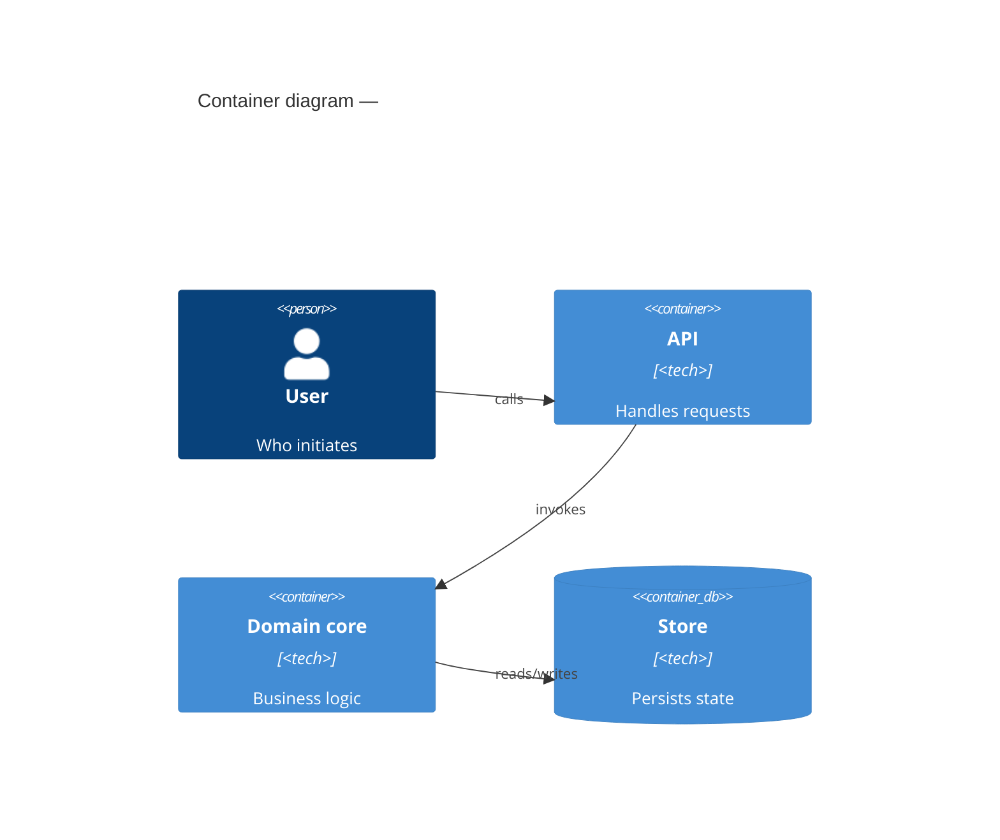
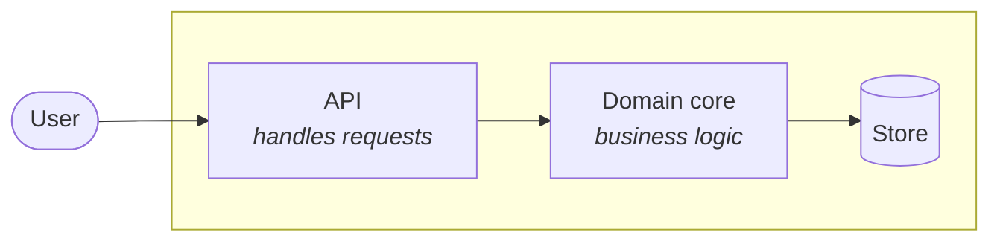
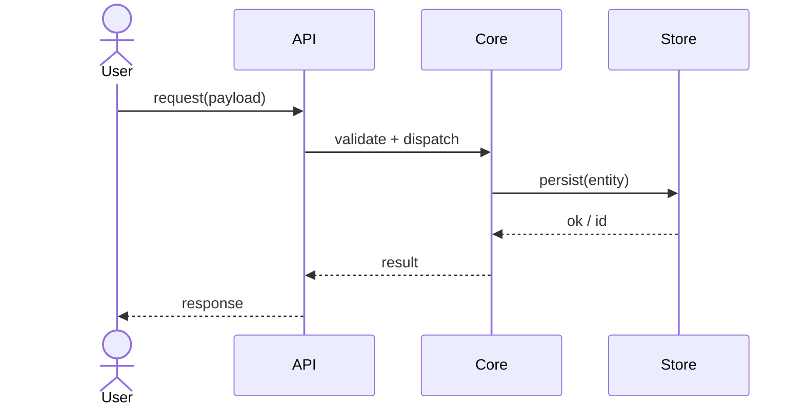
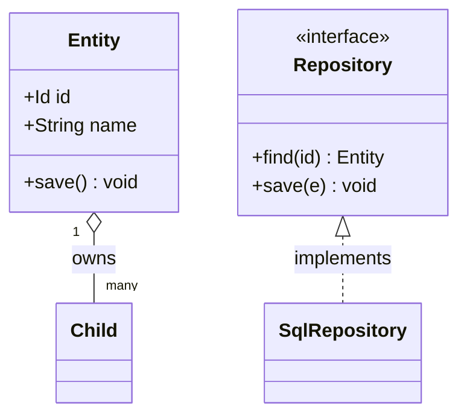
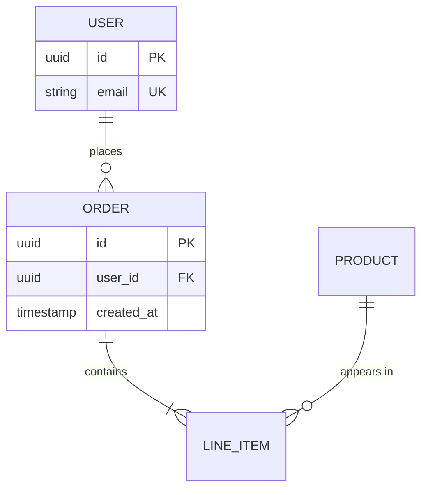
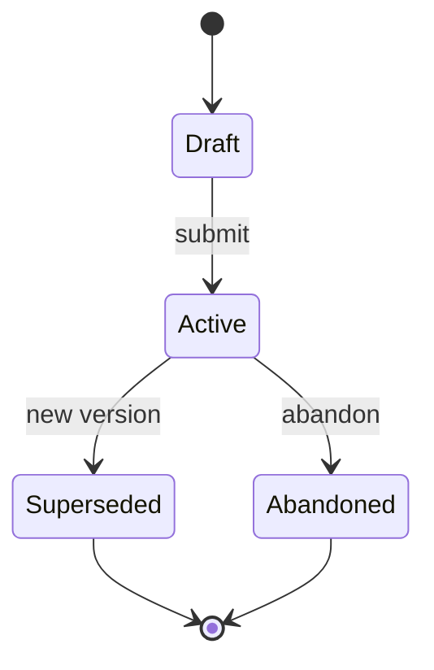
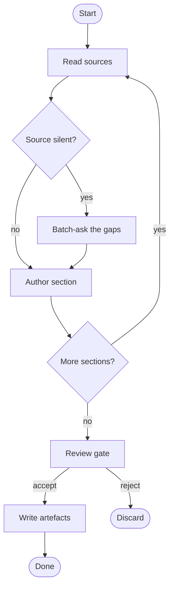

# Mermaid templates for `/blueprint`

Diagram templates the `document` skill references by name. All Mermaid (native in Obsidian + GitHub). Each template shows the shape; the skill fills it from the source. Fan-out caps from `SKILL.md` §4.5 apply.

## `c4-architecture`

C4-style component/container view. **Emit both** a native C4 block and a flowchart fallback, with the note — native `C4*` blocks render inconsistently across Obsidian Mermaid versions; the flowchart is the guaranteed floor.

Native block:

Flowchart fallback (always include directly below the native block):

With the note line beneath: *"C4 shown as a native block (preferred) with a flowchart fallback for renderers without C4 support."*

## `sequence`

Runtime flow. One per primary scenario. In Mode 2, prefix with the inferred marker.

Cap: > ~12 participants → split per sub-scenario, note the split.

## `class`

Data-model types and their relations.

Stereotypes: `<<interface>>`, `<<abstract>>`, `<<enumeration>>`, `<<record>>`. Relations: `<|--` extends, `<|..` implements, `o--` composition, `*--` aggregation. Cap: > ~15 nodes → split per module/aggregate.

## `er`

Persisted-entity relations (data layer).

## `state`

Lifecycle of a stateful entity.

## `activity`

Process flow with decision branches (Mermaid has no native activity diagram — use a flowchart).

## Conventions

- Use `%%{init: {"flowchart": {"defaultRenderer": "elk"}}}%%` on dense flowcharts (codemap-visualize precedent) so layout stays readable.
- One Mermaid block per logical diagram. In per-section vault split, each section note carries its own blocks (Obsidian renders faster one-per-note).
- Mode 2: every behavioral diagram (`sequence`, `state`) starts with the `%% inferred — verify against runtime` comment.
