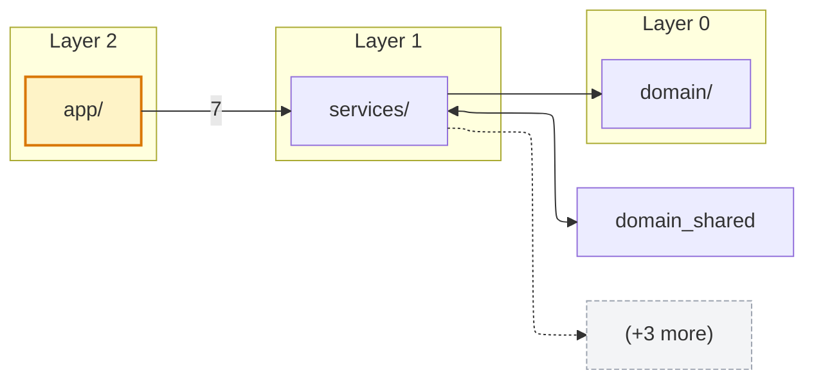
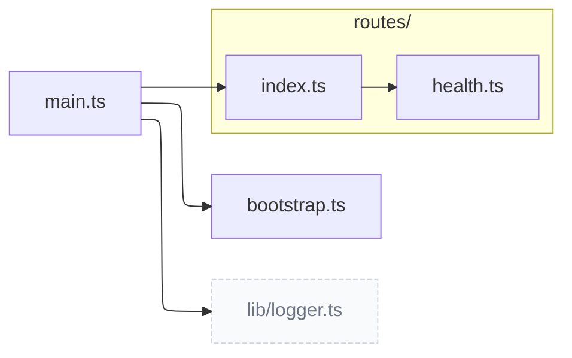
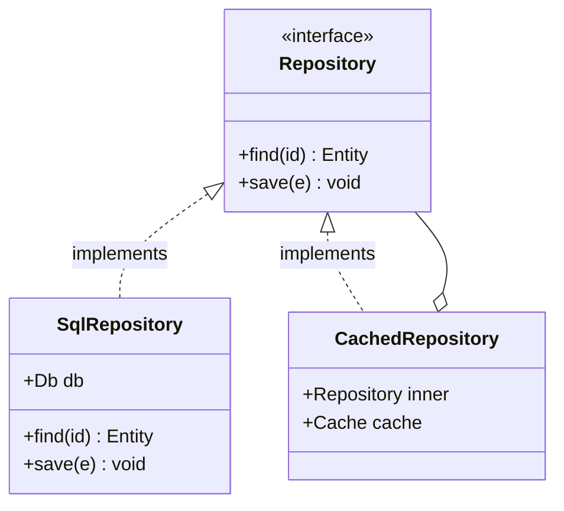

# codemap-visualize

Reads `.claude/codemap.md` and emits a UML-heavy technical document: an ASCII Structure tree, a topologically layered **top-down Module map** (edges labeled with relation weight, most-depended-on modules highlighted as hubs, dependency cycles flagged, plus a legend), per-module sections (short paragraph + subfolder-clustered file graph + classDiagram + files list), a cross-module class relations diagram when relevant, per-module **call-graph** diagrams (TS/C# edges rendered type-resolved as `Type.method` where the codemap resolved them, bare-name syntactic fallback otherwise), and Mermaid **sequence diagrams** for a few high-signal entry points (static call-structure order, explicitly *not* a runtime trace). Writes one in-repo artifact (`.claude/codemap.diagrams.md`) for AI consumption and GitHub rendering, plus one Obsidian vault artifact for human reading.

The text codemap stays the source of truth. This skill produces a derived view; it never re-scans the filesystem.

## How to run (for Claude Code)

Implemented as a standalone Node script — [`codemap-visualize.mjs`](./codemap-visualize.mjs), co-located in this skill folder — shared with Copilot ([.github/prompts/codemap-visualize.prompt.md](../../.github/prompts/codemap-visualize.prompt.md)). The procedure below is the contract the script implements.

Resolve the script **relative to this SKILL.md's real location**, never relative to CWD and never via a hardcoded path — the skill is symlinked into `~/.claude/skills/` on each machine, so CWD-relative and home-relative paths break. Follow the symlink with `realpath`, then run the co-located script:

```sh
SKILL_DIR="$(dirname "$(realpath "$0")")" # $0 = this SKILL.md's path as invoked
node "$SKILL_DIR/codemap-visualize.mjs" # writes.claude/codemap.diagrams.md
node "$SKILL_DIR/codemap-visualize.mjs" --dry-run # preview to stdout
node "$SKILL_DIR/codemap-visualize.mjs" --vault "<vault-root>" # also write to Obsidian vault (per-module split by default)
node "$SKILL_DIR/codemap-visualize.mjs" --project-folder Stream # override inferred ProjectFolder
```

Vault root (`<Vault>`) is read from machine-local config — `vaultRoot` in `~/.claude/hook-config.json` — **never hardcoded** (per `universal/no-hardcoded-machine-paths.md`; the user has two PCs, other users have their own). Pass it as `--vault "<vaultRoot>"`. If `vaultRoot` is unset, write only the in-repo artifact and surface *"Set `vaultRoot` in `~/.claude/hook-config.json` to also write the vault copy."* The script infers `<ProjectFolder>` from repo name (`*isar*` / `stream-*` → `Stream`, else the project name). Override with `--project-folder` when needed. On vault-write failure, the script prints the exact `outsideProjectWriteBlocker.allow` line to add.

Per-project tuning (caps, skip patterns, renderer, vault layout) lives under the `## Visualize` section of `.claude/codemap.config.md` — see the [Visualize config](#visualize-config) reference below.

## When to run

- User types `/codemap-visualize`.
- User asks to render / draw / diagram / visualize the codemap.
- Do **not** auto-fire.
- Do **not** chain after `update-codemap` — they compose by user invocation, not by call.

## Inputs

1. **Project root.** `$CLAUDE_PROJECT_DIR` if set, otherwise the current working directory.
2. **Source codemap.** `<root>/.claude/codemap.md`. Required. If missing, instruct the user to run `/update-codemap` first and stop.
3. **Module-level dependency adjacency.** Parsed from `## Dependencies`. Accepts both weighted (`bar/ (12)`) and legacy bare (`bar/`) forms; legacy entries are treated as weight 1. If absent, module-edges are synthesised from `## File deps` (every file→file edge whose endpoints live in different top-level modules contributes weight 1). Notes line surfaces the synthesis fallback if the section is missing.
4. **File-level dependency adjacency.** Parsed from `## File deps` (file→file edges, written by `update-codemap` from v2 onward). If absent, per-module file graphs render nodes only and a Notes line tells the user to re-run `/update-codemap` to enrich.
5. **Class graph.** Parsed from `## Class graph` — block-per-class with `kind: Name in path`, plus indented `namespace`, `extends`, `implements`, `attributes`, and `fields: name: Type; name: Type` (using `; ` separator). Drives the per-module class diagrams and the cross-module class relations diagram. If absent, both class-diagram sections are omitted silently — no Notes line, since not every project has a meaningful OO surface.
6. **Per-project visualize config.** Parsed from `<root>/.claude/codemap.config.md` → `## Visualize` section. See the [Visualize config](#visualize-config) reference below.
7. **Obsidian vault path.** Inferred per the project-folder rule in global CLAUDE.md (`Code Reviews` convention) — `*isar*` / `stream-*` → `Stream`; otherwise match an existing `Projects/<Name>/` subfolder, else ask once.

## Procedure

### 1. Resolve project root, project name, vault path

- Project root and project name: identical resolution to `update-codemap` (README h1 → package.json name → csproj → directory name).
- Obsidian vault path: `<Vault>/Projects/<ProjectFolder>/Codemap/<project>-codemap.md`, where `<Vault>` = the `vaultRoot` config value (see "How to run"). Flat file; do not create subfolders.
- `<ProjectFolder>` inference reuses the PR-review rule. When in doubt between two candidates, ask the user once before writing.

### 2. Read and parse `.claude/codemap.md`

Parse the existing codemap structure:

- **Top-level groups** (`## <dir>/` headings) → module nodes, file lists, and Structure tree leaves.
- **File entries** under each group → file-graph nodes.
- **`exports:` lines** → Files-list children; the export list also drives class-diagram method emission when a file contains exactly one class.
- **`## Layers`** section, if present → declared layer clustering for the Module map (overrides topological auto-layering).
- **`## Entry points`** section, if present → Module map highlighted nodes (`:::entry` class).
- **`## Dependencies`** section, if present → module-level adjacency for Module map edges. If absent, edges are synthesised from `## File deps` (counted per cross-module file→file edge).
- **`## File deps`** section, if present → file-level adjacency. Drives per-module File graphs and the module-edge fallback.
- **`## Class graph`** section, if present → class kind, namespace, extends, implements, attributes, fields. Drives per-module class diagrams and cross-module class relations.

If the codemap predates the extended format and lacks Layers / Entry points / Dependencies / File deps / Class graph, render what is available and add Notes lines surfacing each gap.

### 3. Compose the document

The output is a single technical document built from five composed parts, in this order. Each part is independent — partial inputs degrade individual parts but don't block the rest.

**3a. Structure tree.** ASCII tree (in a plain code fence, not Mermaid) of top-level modules and their immediate subfolders. Each module line shows the file count; each subfolder line is annotated `— subfolder`. Modules and files matched by `## Visualize` `skip:` are excluded. The `./` and `.claude/` groups (if present) are dropped.

**3b. Module map.** One Mermaid `graph TB` (top-down) diagram, scope = whole project — upstream/entry layers at the top, leaf utilities at the bottom. Renderer hint (ELK by default) is emitted as a `%%{init:...}%%` directive so Mermaid picks layered layout. A legend below the diagram explains the styling.

- Nodes: one per top-level directory, minus any matched by `## Visualize` `skip:`.
- Entry points: render with `:::entry` class (distinct fill).
- **Hubs:** the most-depended-on modules (top ~15% by inbound edge weight) render with a `:::hub` class so the architecture's load-bearing centres read at a glance.
- **Cycle nodes:** modules on a detected dependency cycle get a distinct red stroke, so a cycle reads visually, not only in the `### Cycles detected` text block.
- **Layers — declared OR auto.** When `## Layers` is present in `.claude/codemap.config.md`, it wins: modules are clustered by `subgraph <LayerName>` and any module not assigned to a declared layer goes into a synthetic `Unlayered` bucket. When absent, layers are derived topologically — a cycle-tolerant DFS post-order assigns each module `layer = 1 + max(layer of its dependencies)`, settling over at-most-N passes so cycles stabilise. Sources land in `Layer 0`, sinks high.
- Edges: from `## Dependencies`, weighted. If `## Dependencies` is missing, module-edges are synthesised by counting cross-module file→file edges from `## File deps`.
 - **Intra-layer edges are dropped.** They belong in the per-module File graphs.
 - **Bidirectional pairs (A→B and B→A) collapse to a single `A <--> B` edge.** Both halves are still flagged in a `### Cycles detected` block.
 - **Top-N filter per source:** the `l1-edge-cap` config (default 8) caps outgoing edges per node. Overflow renders as a single dashed `(+K more)` ghost node connected via a dotted edge.
 - **Weight labels:** every edge is labeled with its weight (`--> |<weight>|`) so the relation strength (number of cross-module import edges) reads directly, not as a bare arrow.

**3c. Modules.** One `### <module>/` section per visible top-level module, alphabetical. Each section contains:

- A short paragraph: `<N> files, <K> exported symbols, <C> declared types.`
- `#### File graph` — Mermaid `graph LR`, files clustered into `subgraph sub_<X>["<X>/"]` per immediate sub-folder. Files at the module root (no sub-folder) render outside any subgraph. Outbound edges to files in other modules render as `:::ghost` nodes labelled with the full target path so the boundary crossing is visible. Caps `l2-file-cap` (default 40, ranked by edge degree) and `l2-edge-cap` (default 80, intra-first then outbound) apply; each truncation appends a one-line italic note below the diagram.
- `#### Class diagram` (only when the module contains classes from `## Class graph`) — Mermaid `classDiagram` with one node per class. Class bodies show: stereotype (`<<interface>>` / `<<enumeration>>` / `<<struct>>` / `<<record>>` / `<<abstract>>` — abstract inferred from `attributes:` containing the word "abstract" or `extends:` starting with `Abstract`), up to 8 fields (deduped by name), and up to `class-method-cap` (default 6) method-shaped exports — but method extraction only fires when the file contains exactly one class, to avoid misattributing exports across siblings. Relations: `<|--` for `extends`, `<|..` for `implements`, `o--` for composition when a field's type matches another in-scope class. Edges are only emitted when **both** endpoints are in the module; cross-module relations are deferred to the Cross-module section.
- `#### Files` — flat list, one line per file with its purpose, with nested bullets for each export from the codemap. When the source codemap lists names only (`exports: foo, bar`), reproduce names only — never invent signatures.

**3d. Cross-module class relations.** Optional. A single Mermaid `classDiagram` covering only `extends`/`implements` edges whose parent class lives in a different module than the child. Each rendered class node carries its module name as a synthetic field so it's clear which side of the boundary it belongs to. Section is omitted entirely when no such edges exist.

**3e. Call graph.** Optional, from `## Call graph`. Per-module Mermaid `graph LR` of caller → callee edges, ranked project-internal-first with a per-module cap. Callees that the codemap resolved (TypeScript / C#) render as `Type.method` nodes; unresolved callees render as the bare name (syntactic fallback). The legend states whether any edges are type-resolved. Omitted when the codemap has no `## Call graph`.

**3f. Sequence diagrams.** Optional, from `## Call sequence`. A small set of Mermaid `sequenceDiagram`s for the highest-signal entry points (ranked by distinct project-internal callees), each expanding the ordered call chain. Builtin/stdlib noise is filtered to project symbols. Every diagram carries a caption that it is **static call-structure order, not a runtime execution trace** (no conditionals/loops/await timing). Omitted when the codemap has no `## Call sequence`.

**3e. Notes.** Caveats from earlier steps: missing `## Dependencies`, missing `## File deps`, no `## Layers` (auto-layering used), no `## Entry points`, modules hidden by `skip:` patterns, etc. The script appends a line per condition so the user sees what's missing without re-running anything.

### 4. Mermaid templates

**Module map (3b):**



**File graph (3c):**



**Class diagram (3c, 3d):**



### 5. Output file structure

Single in-repo artifact, this exact shape:

```markdown
# Codemap — <project-name>
Last rendered: <YYYY-MM-DD>
Source: `.claude/codemap.md` (last updated: <date from source>)

## Structure

<code-fenced ASCII tree>

## Module map

<mermaid block>

(optional `### Cycles detected` block)

## Modules

### <module>/

<short paragraph>

#### File graph
<mermaid block>

#### Class diagram (omitted when module has no classes)
<mermaid block>

#### Files
- `<rel>` — <purpose>
 - <export>

(repeats per module, alphabetical)

## Cross-module class relations (omitted when no cross-module class edges)

<mermaid block>

## Notes

- <caveats>
```

### 6. Write artifacts atomically

These are derived artefacts (rendered from the source codemap, not authored content), so the writes are **announced before overwriting** but intentionally not propose-confirm-gated — a confirm on every render would be ceremony.

**In-repo artifact (always single-file):**
- `<root>/.claude/codemap.diagrams.md`. Overwrite. Create `.claude/` if missing.
- One file because this artifact is for AI consumption and GitHub rendering — both prefer a single scrollable file.

**Vault artifact (layout depends on `split-per-module`):**

*Single-file mode* (`split-per-module: false`) — historical layout, preserved for opt-out:
- `<Vault>/Projects/<ProjectFolder>/Codemap/<project-slug>-codemap.md`. Overwrite. Create `Codemap/` if missing.
- Identical to the in-repo copy plus YAML frontmatter.

*Per-module mode* (`split-per-module: true`, default) — recommended for projects with > ~10 modules:
- Index note: `<Vault>/Projects/<ProjectFolder>/Codemap/<project-slug>-codemap.md`. Contains YAML frontmatter, the Structure tree, the Module map, a `## Modules` section with Obsidian wikilinks (`[[<project-slug>/<module-slug>|<module>/]]`) and per-module stats (file count, type count, intra-edge count, outbound count), the Cross-module class relations diagram when present, and the Notes section.
- Module notes: `<Vault>/Projects/<ProjectFolder>/Codemap/<project-slug>/<module-slug>.md`, one per module. Each contains YAML frontmatter, a back-link to the index, and the module's full section (short paragraph + File graph + Class diagram when present + Files list). Obsidian renders one Mermaid diagram per note — far faster than rendering ~40 diagrams in one note on large projects.

Frontmatter (both modes):

```yaml
---
project: <project-name>
repo: <repo path>
source:.claude/codemap.md
rendered: <YYYY-MM-DD>
---
```

**Vault write allowlist:** the vault path must be allowlisted in `~/.claude/hook-config.json` under `outsideProjectWriteBlocker.allow`. The existing `Code Reviews/` allowlist does not cover `Codemap/`. On first run, if the write is blocked, surface the exact line to add:

```
Add to ~/.claude/hook-config.json → outsideProjectWriteBlocker.allow:
 "<vaultRoot>/Projects/*/Codemap/**"
```

(Substitute the actual `vaultRoot` config value when surfacing the line to the user — e.g. `<vaultRoot>/Projects/*/Codemap/**` becomes the user's configured vault path.)

Do not edit `hook-config.json` from this skill. The user owns hook-config edits.

### Notes hints

The `## Notes` section at the bottom of the rendered file is not just for caveats — it surfaces what's missing so a flat / edgeless document isn't silent. The script appends a line per condition:

- Both `## Dependencies` and `## File deps` missing → `Module map has no edges — source codemap has no ## Dependencies and no ## File deps to synthesise from. Re-run update-codemap.`
- All file-deps are intra-module → `Module map has no edges — all file-level dependencies are intra-module (no cross-module imports detected).`
- No `## Layers` declared → `Module map auto-layered topologically — no ## Layers declared in.claude/codemap.config.md.`
- Missing `## Entry points` → `Module map has no entry-point highlighting — no ## Entry points in source codemap.`
- Modules hidden by `## Visualize` `skip:` → `L1: N module(s) hidden by ## Visualize skip: <list>.`

These hints surface the diagnostic information at the bottom of the rendered file, so the user can act without re-running anything to inspect intermediate state.

### 7. Report

Print:

```
Wrote.claude/codemap.diagrams.md
Wrote <Vault>/Projects/<ProjectFolder>/Codemap/<project>-codemap.md (+ N module notes)
Source codemap age: X days
```

If the source codemap is older than 7 days, append:
```
Source codemap is X days old. Consider /update-codemap before re-rendering.
```

If `.claude/codemap.dirty` exists, append:
```
Source codemap is marked dirty (auto-update flag). Run /update-codemap first.
```

## What codemap-visualize does NOT do

- Does not scan the filesystem. Source-of-truth is `.claude/codemap.md`.
- Does not run `update-codemap`. User invokes them separately.
- Does not delete the vault file when the in-repo file is removed. Vault hygiene is the user's call.
- Does not edit `hook-config.json`. Allowlist entries are user-owned.
- Does not itself analyse code. The call-graph and sequence-diagram renders (3e / 3f) consume the `## Call graph` / `## Call sequence` the *codemap* already extracted; this skill only draws them. (The per-module Files list remains a flat export index, separate from the call graph.)
- Does not commit to git.
- Does not auto-fire. Manual only.

## Visualize config

`.claude/codemap.config.md` `## Visualize` section. All keys optional; absent keys fall back to defaults.

```markdown
## Visualize

- skip: `vendor/**`
- skip: `**/__snapshots__/`
- l1-edge-cap: 8
- l2-file-cap: 40
- l2-edge-cap: 80
- class-method-cap: 6
- renderer: elk
- split-per-module: true
```

**Key reference:**

- `skip: <glob>` — gitignore-style glob. Modules and files matched are excluded from the Structure tree, Module map, per-module File graphs, Class diagrams, and Files lists. The source `codemap.md` is **not** modified; the file remains indexed for AI consumption. Use this to hide noise from diagrams without losing it from the textual codemap (e.g. third-party generated code that's already tagged `## Vendored` in the source codemap but still adds clutter to the diagrams). Multiple `skip:` bullets allowed.
- `l1-edge-cap: <int>` — top-N outgoing module edges per source on the Module map. Default `8`. Overflow renders as a single `(+K more)` dashed node.
- `l2-file-cap: <int>` — max files per module File graph. Default `40`. Files ranked by edge degree; overflow noted in italics below the diagram.
- `l2-edge-cap: <int>` — max edges per module File graph. Default `80`. Intra-module edges emitted first, then outbound.
- `class-method-cap: <int>` — max method-shaped exports rendered per class in Class diagrams. Default `6`. Only applies when the file contains exactly one class (otherwise methods would be misattributed across siblings). Fields are separately capped at 8 (not configurable).
- `renderer: elk | dagre` — Mermaid flowchart renderer. Default `elk`. ELK handles dense / layered graphs much better than dagre; switch to `dagre` only if your Mermaid environment lacks ELK support.
- `split-per-module: true | false` — vault output layout. Default `true`. See §6 above.

Glob semantics match the `## Skip` and `## Vendored` sections in `update-codemap` — same parser, same rules.

## Limits (v1)

- Mermaid only (plus an ASCII tree for the Structure section, in a plain code fence). No PlantUML, no Graphviz, no Mermaid alternative for the rest. Obsidian + GitHub both render Mermaid natively; duplication isn't worth the file weight.
- Module-map edges come from the codemap's `## Dependencies` section, falling back to synthesis from `## File deps`. File-graph edges come from `## File deps`. Quality is bounded by `update-codemap`'s extraction (tree-sitter AST across ~18 languages; basename-index resolution for bare-name C++ includes; regex only as a no-deps fallback). Cross-language imports may be missed.
- Class-diagram quality is bounded by `update-codemap`'s `## Class graph` extraction — extends/implements/fields are parsed from source-language declarations (per-language extractor). Generics are stripped to the head identifier for relation matching. Methods are pulled from `exports:` only when a file contains exactly one class, so multi-class files render bodies without methods.
- Vault output: one index note + N module notes per project when `split-per-module: true`; one file when `false`. In-repo artifact is always single-file.
- Fan-out caps (`l2-file-cap`, `l2-edge-cap`, `class-method-cap`) are guards. If a module routinely exceeds them, the module is probably too large — that is a finding for `/review`, not a `codemap-visualize` bug.
- No incremental render. Always full rewrite of both artifacts.

## Relationship to other skills

- **update-codemap** — produces the source `.claude/codemap.md` this skill consumes. Run first.
- **review / pr-review** — both skills already use Mermaid diagrams; the vault layout (`Projects/<ProjectFolder>/...`) and `<ProjectFolder>` inference rule are shared. `codemap-visualize` mirrors that convention exactly.
- **prep** — does not consume codemap diagrams. Prep primes from architectural rules, not from rendered visuals.
