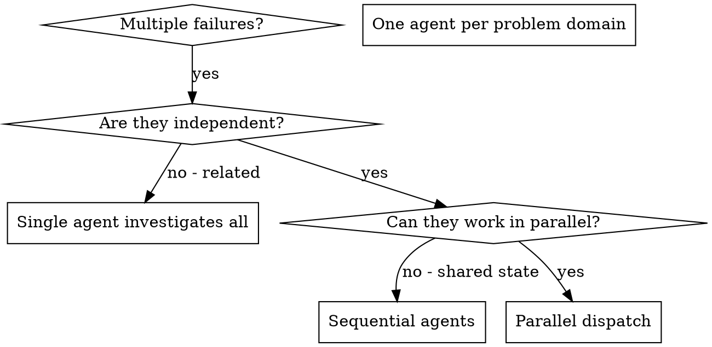

# Dispatch

## Overview

You delegate tasks to specialized agents with isolated context. By precisely crafting their instructions and context, you ensure they stay focused and succeed at their task. They should never inherit your session's context or history — you construct exactly what they need. This also preserves your own context for coordination work.

When you have multiple unrelated failures (different test files, different subsystems, different bugs), investigating them sequentially wastes time. Each investigation is independent and can happen in parallel.

**Core principle:** Dispatch one agent per independent problem domain. Let them work concurrently.

**Before any Agent-tool call, walk the three hard-cap gates in [Hard caps](#hard-caps). A failed gate aborts the dispatch.** The hard caps prevent runaway recursion, geometric cost compounding, and parent loss of synthesis — failure modes the soft "When to Use / When NOT to Use" heuristics below do not catch on their own.

## When to Use



**Use when:**
- 3+ test files failing with different root causes
- Multiple subsystems broken independently
- Each problem can be understood without context from others
- No shared state between investigations

**Don't use when:**
- Failures are related (fix one might fix others)
- Need to understand full system state
- Agents would interfere with each other

## The Pattern

### 1. Identify Independent Domains

Group failures by what's broken:
- File A tests: Tool approval flow
- File B tests: Batch completion behavior
- File C tests: Abort functionality

Each domain is independent - fixing tool approval doesn't affect abort tests.

### 2. Create Focused Agent Tasks

Each agent gets:
- **Specific scope:** One test file or subsystem
- **Clear goal:** Make these tests pass
- **Scope, stated positively:** name what they *may* edit (e.g. "edit only `src/auth/`"). Negative "don't touch X" fences barely work on their own (~0% deterrent — see `/orchestrate`'s sourced finding); positive scope guides attention, and hard placement (worktree / allowlist) is what holds them in bounds.
- **Expected output:** Summary of what you found and fixed

### 3. Dispatch in Parallel

```typescript
// In Claude Code / AI environment
Task("Fix agent-tool-abort.test.ts failures")
Task("Fix batch-completion-behavior.test.ts failures")
Task("Fix tool-approval-race-conditions.test.ts failures")
// All three run concurrently
```

### 4. Review and Integrate

When agents return:
- Read each summary
- Verify fixes don't conflict
- Run full test suite
- Integrate all changes

## Agent Prompt Structure

Good agent prompts are:
1. **Focused** - One clear problem domain
2. **Self-contained** - All context needed to understand the problem
3. **Specific about output** - What should the agent return?
4. **Depth-annotated** - Tells the subagent its current depth and remaining depth budget (required by Gate 2 of [Hard caps](#hard-caps)).

The depth annotation is a single line at the top of the subagent's prompt:

```
You are a depth-N subagent. Maximum allowed depth is 2. You may spawn one more level only if N < 2; beyond that, return work to your parent rather than spawning.
```

Where N is the current depth (1 if dispatched by the user-facing agent, 2 if dispatched by a depth-1 subagent). The parent always knows N because the parent itself was told its depth on dispatch — passing the count down by convention requires no harness change.

Full example with the annotation:

```markdown
You are a depth-1 subagent. Maximum allowed depth is 2. You may spawn one more level only if needed; beyond that, return work to your parent rather than spawning.

Fix the 3 failing tests in src/agents/agent-tool-abort.test.ts:

1. "should abort tool with partial output capture" - expects 'interrupted at' in message
2. "should handle mixed completed and aborted tools" - fast tool aborted instead of completed
3. "should properly track pendingToolCount" - expects 3 results but gets 0

These are timing/race condition issues. Your task:

1. Read the test file and understand what each test verifies
2. Identify root cause - timing issues or actual bugs?
3. Fix by:
 - Replacing arbitrary timeouts with event-based waiting
 - Fixing bugs in abort implementation if found
 - Adjusting test expectations if testing changed behavior

Do NOT just increase timeouts - find the real issue.

Return: Summary of what you found and what you fixed.

If you reach a decision, lesson, or landmine worth remembering beyond this task, emit a `harvest:` block (decisions / lessons / open_questions) per "Harvesting subagent state". Omit it if there's nothing worth keeping.
```

## Output contract (for agents that declare one)

Some agents under `agents/` declare an `## Output contract` section specifying a YAML schema their response must follow. When such an agent is dispatched, a PostToolUse hook on the Agent tool (`hooks/agent-output-contract-validator.js`) validates the last fenced ```yaml block in the response and emits a non-blocking advisory in the orchestrator's next turn if the block is missing or malformed.

**Opt-in is per-agent and detected automatically:** add `## Output contract` and `## Required reads` sections to the agent's `.md` and the hook starts checking on the next dispatch. There is no allow-list to maintain. Agents without those sections are unchanged in behaviour.

**Pilot agents (v1):** `c-sharp-pro`, `unity-pro`. The advisory is informational — it never rejects the agent response, so an orchestrator that needs strict compliance must re-dispatch on its own initiative. The schema and design rationale live in `.claude/specs/agent-output-contracts/v1.md`.

## Harvesting subagent state

A subagent runs in **isolated context** — correct for focus, a liability for *state*. A decision it reaches, a landmine it hits, or an open question it surfaces dies with its context unless the parent notices it in the free-text summary and chooses to capture it by hand. The `harvest:` block is a **narrow, structured return channel** that closes that leak without breaking isolation (the opposite of dumping full context back across the boundary).

Any subagent **may** append an optional `harvest:` block when — and only when — it produced something worth remembering beyond its own task. A subagent with nothing capture-worthy omits it entirely (no ceremony):

```yaml
harvest:
 decisions:
 - what: "Chose longest-prefix walk over per-file lookup for scope resolution"
 why: "O(depth) not O(files); matches the submodule mental model"
 scope: [scope-resolution]
 lessons:
 - what: "ELK renderer needed for >40-node Mermaid graphs; dagre overflows"
 kind: warning
 scope: [codemap, visualization]
 open_questions:
 - "Does PreCompact expose the live transcript or only the on-disk lag?"
```

**What happens to it.** The `agent-output-contract-validator.js` hook (PostToolUse on Agent) scans every subagent response for a top-level `harvest:` block, independently of any `## Output contract` (the two coexist — a response may carry both; they're parsed separately). When the block is present and non-empty, the hook emits a **non-blocking advisory** in your next turn summarising the counts. You then route each item on the **user's** confirmation:
- `decisions[]` → `/capture` with `kind: decision`
- `lessons[]` → `/capture` with `kind: lesson` (or `kind: warning` when the item carries `kind: warning` — a subagent-discovered landmine reaches the highlighted warning tier without re-classification)
- `open_questions[]` → carry into your working notes / the next `/recap`

**Nothing is auto-written.** The hook *surfaces*; capture stays Mode A — the user accepts/edits/rejects every memory write (collaborator, not auto-learner). The subagent's `kind: warning` self-tag is a *proposal* the user can override at capture time.

**The dispatch-prompt line.** Alongside the depth annotation (Gate 2), every dispatch prompt should invite the block:

> If you reach a decision, lesson, or landmine worth remembering beyond this task, emit a `harvest:` block per the return contract (decisions / lessons / open_questions). Omit it entirely if there's nothing worth keeping.

This is one line; it carries no obligation. It is the State-side complement to the depth annotation's Instructions-side discipline (027 = don't spawn badly; 050 = don't lose what a good spawn learned).

## Common Mistakes

**❌ Too broad:** "Fix all the tests" - agent gets lost
**✅ Specific:** "Fix agent-tool-abort.test.ts" - focused scope

**❌ No context:** "Fix the race condition" - agent doesn't know where
**✅ Context:** Paste the error messages and test names

**❌ Negative fence:** "Do NOT change production code" — ~0% deterrent on its own (see `/orchestrate`)
**✅ Positive scope:** "Edit only the test files" — and for write tasks, place the agent where that scope is physically enforced

**❌ Vague output:** "Fix it" - you don't know what changed
**✅ Specific:** "Return summary of root cause and changes"

## When NOT to Use

**Related failures:** Fixing one might fix others - investigate together first
**Need full context:** Understanding requires seeing entire system
**Exploratory debugging:** You don't know what's broken yet
**Shared state:** Agents would interfere (editing same files, using same resources)

## Hard caps

Three gates every dispatch must pass. These are **hard caps**, not heuristics — a failed gate aborts the dispatch. They exist because the failure mode they prevent (runaway recursion) is severe and silent: by the time the call tree is deep, the parent has already lost the ability to synthesize, and cost has compounded geometrically.

Source rule: `~/.claude/projects/<slug>/memory/architectural-rules/universal/subagent-recursion-caps.md`. Drift between this skill and the rule is itself a failure to flag — they must stay aligned.

### Gate 1 — Tier check

Before dispatching, check the parent's tier and the requested subagent's tier.

- **If the parent is Haiku, refuse to spawn.** Haiku-tier agents do not spawn further subagents. If a Haiku-tier task realizes it needs to delegate, the task was wrong-sized for Haiku — return work to the parent rather than spawning. Haiku is for bulk mechanical work with no judgment; the very act of needing to delegate is itself a judgment signal.
- **If the requested subagent tier is higher than the parent's tier, refuse to spawn.** Anti-escalation rule: subagents do not spawn at a higher tier than their parent. Return to the parent with a one-line user-visible justification for the tier upgrade so the parent can dispatch directly. Subagents do not silently upgrade themselves.

### Gate 2 — Depth check

Before dispatching, check the current spawn depth.

- **Maximum spawn depth is 2.** Parent → subagent → at most one more tier. Beyond that, synthesis becomes impossible to track and the parent loses any meaningful claim to "owning the final output."
- **If the current depth is 2 or greater, refuse to spawn further.** Do this work in the current agent.
- **Sibling spawns at the same depth are not capped.** A parent spawning N independent subagents in one batch is fine and encouraged — the cap is on *depth*, not *width*.

How to know the current depth: subagents are told their depth by the parent in their prompt (see "Agent Prompt Structure" — every dispatch annotates the subagent's depth). Subagents that didn't get the annotation conservatively assume they are at depth 1 and refuse further dispatch.

### Gate 3 — Justification surface

Even when Gates 1 and 2 pass, the dispatch protocol requires user-visible text **before** the Agent-tool call:

- Which subtask is being delegated.
- Why it benefits from a fresh subagent (isolation / parallelism / mechanical work).
- Which tier is being chosen and why (if not the parent's tier or below).
- How the parent will synthesize the subagent's output.

This is the right interrupt point — the user can stop a dispatch before it happens. Interrupting after the subagent is already running wastes the spawn cost.

**Bulk-batch exception:** when the parent has already established a batch ("I'm batching N file-reads to subagents") in user-visible text once in the session, subsequent dispatches in that same explicit batch may skip restating the justification. The framing covers them. New batches require new justification.

## Example Dispatch

**Scenario:** 6 test failures across 3 files after major refactoring

**Failures:**
- agent-tool-abort.test.ts: 3 failures (timing issues)
- batch-completion-behavior.test.ts: 2 failures (tools not executing)
- tool-approval-race-conditions.test.ts: 1 failure (execution count = 0)

**Decision:** Independent domains - abort logic separate from batch completion separate from race conditions

**Dispatch:**
```
Agent 1 → Fix agent-tool-abort.test.ts
Agent 2 → Fix batch-completion-behavior.test.ts
Agent 3 → Fix tool-approval-race-conditions.test.ts
```

**Results:**
- Agent 1: Replaced timeouts with event-based waiting
- Agent 2: Fixed event structure bug (threadId in wrong place)
- Agent 3: Added wait for async tool execution to complete

**Integration:** All fixes independent, no conflicts, full suite green

## Key Benefits

1. **Parallelization** - Multiple investigations happen simultaneously
2. **Focus** - Each agent has narrow scope, less context to track
3. **Independence** - Agents don't interfere with each other
4. **Speed** - 3 problems solved in time of 1

## Verification

After agents return:
1. **Review each summary** - Understand what changed
2. **Check for conflicts** - Did agents edit same code?
3. **Run full suite** - Verify all fixes work together
4. **Spot check** - Agents can make systematic errors
